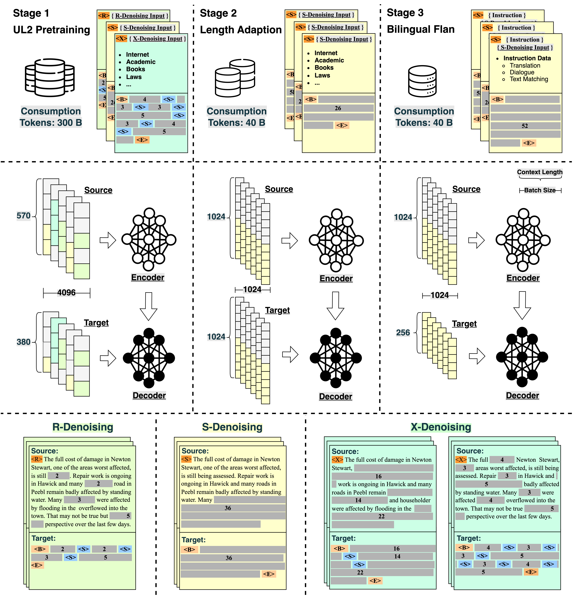
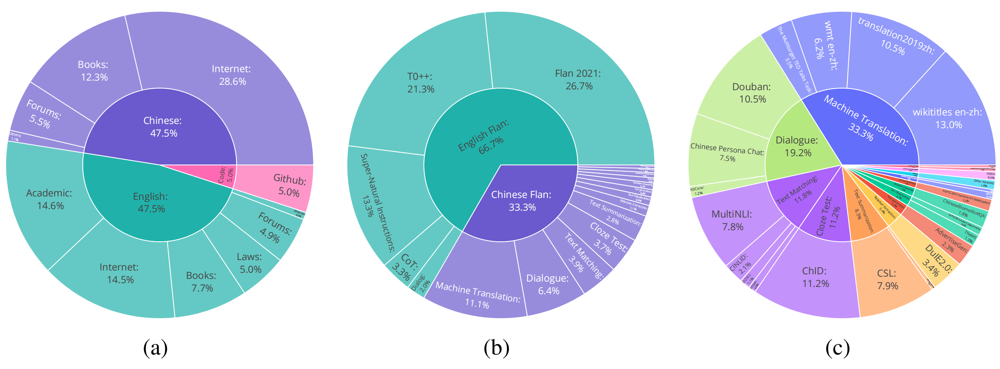

# OpenBT5-LM
This is the official code for OpenBT5: An Open-Sourced 15B Bilingual Flan-T5 Model Pre-trained from Scratch

[](LICENSE)
[](DATA_LICENSE)
[](MODEL_LICENSE)

[[中文版](README_ZH.md)] [[English](README.md)]
## Content
- [Open Source Plan](#open-source-plan)
- [Overview of Training process](#overview-of-training-process)
- [Evaluation Results](#evaluation-results)
  - [C-EVAL](#c-eval)
  - [BBH](#bbh)
  - [Reading Comprehension](#reading-comprehension)
  - [Machine Translation](#machine-translation)
- [Usage](#usage)
  - [Demo](#demo)
  - [Training](#training)
- [Details](#details)
  - [Model Structure](#model-structure)
  - [Data Collection](#data-collection)
- [Disclaimers](#disclaimers)


## Open Source Plan
We are excited to unveil two distinguished versions of our model, with another on the horizon:

- [OpenBT5-LM](https://huggingface.co/OpenBT5/OpenBT5-LM): The backbone language models was pre-trained on 340B English, Chinese, and code tokens. 
- [OpenBT5-Flan](https://huggingface.co/OpenBT5/OpenBT5-Flan): We perform supervised fine-tuning on the base model with additional 40B tokens using our collected BiFlan Dataset.
- OpenBT5-Chat: coming soon

## Overview of Training process
<p align="center" width="100%">
<a target="_blank"></a>
</p>

## Evalution Results

### C-EVAL
Model performance on C-Eval benchmark, where \#Param. denotes the model parameters, $*$ denotes chain-of-thought and Avg. denotes average accuracy. We report the 5-shot and 0-shot performance with diagonal bar division.

| Model | #Param. | STEM | Social Science | Humanities | Others | Avg. | Avg.(Hard) |
| :--- | :---: | :---: | :---: | :---: | :---: | :---: | :---: |
| LLaMA | 65B | 37.8 | 45.6 | 36.1 | 37.1 | 38.8 | 31.7 |
| ChatGLM | 6B | 33.3 | 48.3 | 41.3 | 38.0 | 38.9 | 29.2 |
| Baichuan | 7B | 38.2 | 52.0 | 46.2 | 39.3 | 42.8 | 31.5 |
| MOSS-moon-sft | 16B | 31.6 | 37.0 | 33.4 | 32.1 | 33.1 | 28.4 |
| GLM-130B | 130B | 36.7 | 55.8 | 47.7 | 43.0 | 44.0 | 30.7 |
| OpenBT5 | 15B | 34.8 | 46.6 | 41.1 | 41.5 | 39.8 | 31.1 |
### BBH
Model performance on the BBH benchmark, where \#Param. denotes the model parameters. We report the accuracy score for all the models.

| Model | #Param. | BBH |
| :--- | :---: | :---: |
| ChatGLM | 6B | 31.3 |
| Baichuan | 7B | 31.9 |
| BatGPT | 15B | **34.1**  |
| MOSS | 16B | 29.3 |
| OpenBT5 | 15B | **34.1**  |

### Reading Comprehension
Model performance on BELEBELE benchmark, where \#Param. denotes the model parameters, $\dagger$ denotes 5-shot setting, $\ddagger$ denotes full fine-tuning in English and $*$ denotes the zero-shot setting for instructed models. We report the accuracy score for all the models.

| Model | #Param. | eng_Latn | zho_Hans | zho_Hant | Avg. |
| :--- | :---: | :---: | :---: | :---: | :---: |
| Falcon $(†)$ | 40B | 77.2 | 66.0 | 62.2 | 68.5 |
| LLaMA $(†)$ | 70B | **82.5**  | 64.6 | 57.7 | 68.2 |
| InfoXLM $(‡)$ | 550M | 79.3 | 74.6 | 72.4 | 75.4 |
| XLM-V $(‡)$ | 1.2B | 76.2 | 71.0 | 67.1 | 71.4 |
| LLaMA2-Chat $(*)$ | 70B | 78.8 | 62.4 | 59.3 | 66.8 |
| OpenBT5 $(*)$ | 15B | 78.6 | **75.2**  | **73.7**  | **75.8**  |

### Machine Translation
Model performance on Flores subset containing 50 sentences sampled from Flores benchmark, where \#Param. denotes the model parameters. We report BLEU for all the models.

| Model | #Param. | Zh $\Rightarrow$ En | En $\Rightarrow$ Zh |
| :--- | :---: | :---: | :---: |
| ChatGLM | 6B | 17.2 | 32.5  |
| Alpaca | 7B | 15.1 | 9.8 |
| Alpaca-LoRA | 7B | 16.4 | 14.5 |
| PARROT | 7B | 19.6  | 24.8 |
| BatGPT | 15B | 23.1  | 38.7 |
| MOSS | 16B | 17.2 | 32.5 |
| OpenBT5 | 15B | 23.3 | 37.4  |
## Usage
### DEMO 
First you should install the requirements as below:
```bash
pip install transformers torch>=2.0 sentencepiece
```

For inference, note that we restore the task token `<S>` and special token `<extra_id_0>` in length adaptation and fine-tuning stage, so you may format your instruction input as `<S> {your input} <extra_id_0>` to get a better answer.

Below is a sentence completion example using `OpenBT5-LM`. 
```python
>>> from transformers import AutoTokenizer, AutoModelForSeq2SeqLM
>>> tokenizer = AutoTokenizer.from_pretrained("OpenBT5/OpenBT5-LM", trust_remote_code=True)
>>> model = AutoModelForSeq2SeqLM.from_pretrained("OpenBT5/OpenBT5-LM", trust_remote_code=True).half().cuda()
>>> model = model.eval()
>>> query = "<S>" + "苏州处太湖平原，沿江为高沙平原，河" + "<extra_id_0>"
>>> inputs = tokenizer(query, return_tensors="pt").to("cuda")
>>> outputs = model.generate(**inputs, do_sample=True, max_new_tokens=32)
>>> response = tokenizer.decode(outputs[0], skip_special_tokens=True)
>>> print(response)
流两侧为河淤平原,苏州平原是江苏平原主体,地势低平,土地肥沃,气候温和
```

Below is a instruction example using `OpenBT5-Flan`. 
```python
>>> from transformers import AutoTokenizer, AutoModelForSeq2SeqLM
>>> tokenizer = AutoTokenizer.from_pretrained("OpenBT5/OpenBT5-Flan", trust_remote_code=True)
>>> model = AutoModelForSeq2SeqLM.from_pretrained("OpenBT5/OpenBT5-Flan", trust_remote_code=True).half().cuda()
>>> model = model.eval()
>>> query = "<S>" + "介绍一下中国的四大名著，并分别概括其主要内容" + "<extra_id_0>"
>>> inputs = tokenizer(query, return_tensors="pt").to("cuda")
>>> outputs = model.generate(**inputs, do_sample=True, max_new_tokens=256)
>>> response = tokenizer.decode(outputs[0], skip_special_tokens=True)
>>> print(response)
中国的四大名著分别是《红楼梦》、《西游记》、《水浒传》和《三国演义》。它们分别包括故事情节、文化内涵和历史背景等方面的不同特点。《红楼梦》是一部中国古典小说,讲述了贾宝玉、林黛玉、薛宝钗等一群人物在贾府的生活和爱情故事。《西游记》是中国著名小说,描述了孙悟空、猪八戒、沙悟净等一众妖魔鬼怪的冒险历程和故事。《水浒传》是一部中国古典小说,描述了宋江等一百零八位好汉的反抗故事。《三国演义》是中国古代著名小说,讲述了三国时期的历史和战争故事。这些小说在文学、历史、哲学和文化等方面都有着不同的影响和地位。
```
### Training
Our training code are put in folder `training`. Based on [Megatron-LM](https://github.com/NVIDIA/Megatron-LM/), we made the following implementations:
- SwiGLU activation function,
- UL2 training objective,
- Rotary positional embedding,
- A unified MMap data processing method for both pre-training and fine-tuning phases.

For pre-training, relevant requirements should be installed beforehand as stated in [Megatron-LM](https://github.com/NVIDIA/Megatron-LM/), then you can simply run the following command to process texts into bytes, which can be read faster by a MMap Dataset:

```bash
cd training
bash scripts/data_process_span_corr.sh  # process pre-train data
bash scripts/data_process_flan.sh  # process fine-tune data
```

The you can run distributed training across multi nodes by
```bash
bash scripts/run_pretrain.sh  # pre-train
bash scripts/run_stretch.sh  # length adaptation
bash scripts/run_flan.sh   # fine-tune
```

## Details

### Model Structure
Generally, the OpenBT5 model follows the standard encoder-decoder architecture like T5.
However, it is worth noting that the encoder and decoder serve different roles, where encoder endows model with strong comprehension capability and decoder brings model with generative ability, and there existing works indicate that an encoder-decoder model with more encoder layers can achieve powerful performance.
To fill the gap of deeper decoder-based LLM, we also design an asymmetric structure, where the hyper-parameters are listed in the table below.
| Encoder | Decoder | Attn Heads | $d_{model}$ | $d_{ff}$ | #Param.(B) | Vocab Size | Training Tokens | Pos Emb |
| :---: | :---: | :---: | :---: | :---: | :---: | :---: | :---: | :---: | 
| 12 | 36 | 40 | 4096 | 16384 | 14.6 | 251000 | 380B  | RoPE  |

- Language(s) (NLP): Chinese/English
- License: The code in this project is licensed under the Apache 2.0 license, the model weights are licensed under the GNU AGPL 3.0 license. If you intend to use the models included in this project for commercial purposes or public deployment, please email to us to obtain authorization. Commercial usage information will be used for record purposes only and no fees will be charged.
### Data Collection

<p align="center" width="100%">
<a target="_blank"></a>
</p>
The composition of Data collection. Figure (a) represents the composition ratio of the pre-training dataset. Figure (b) represents the composition of the bilingual Flan dataset. Figure (c) represents the finer-grained composition of the Chinese Flan dataset.

## Disclaimers
The use of the OpenBT5-LM should adhere to societal norms and not be used for any activities that jeopardize national or social security or violate the law. Additionally, we also request users not to use the OpenBT5-LM for internet services that have not undergone appropriate security review and documentation. We hope that all users will abide by this principle to ensure that technological development occurs in a regulated and legal environment.

We have done our best to ensure the compliance of the data used during the model training process. However, despite our significant efforts, unforeseen issues may still arise due to the complexity of the model and data. If misleading or harmful statements are generated through the use of the models included in this project or their modified versions while providing services, the responsibility lies with the service provider and is not associated with this project.

