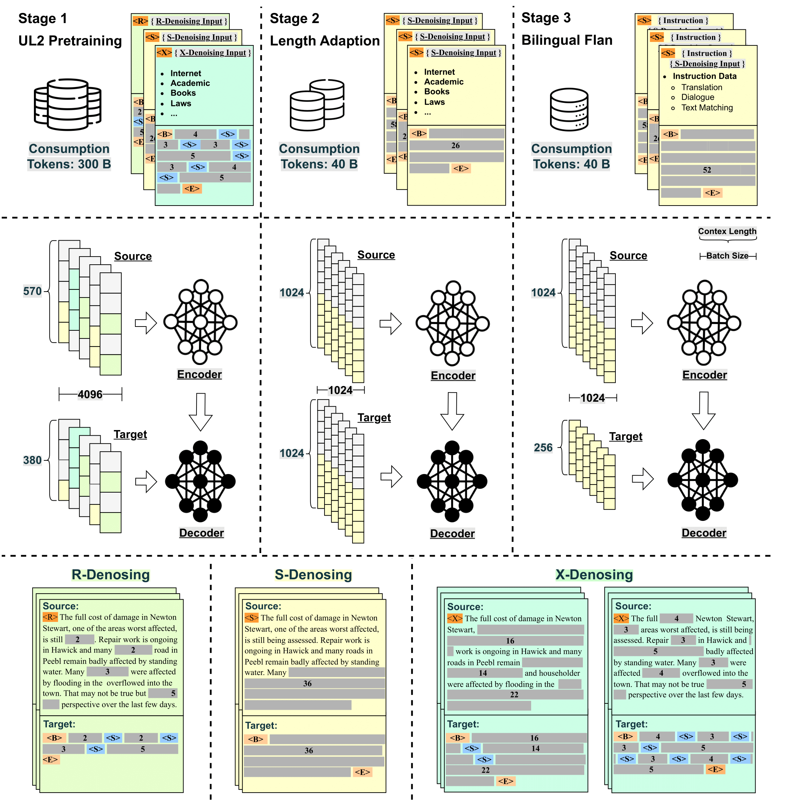
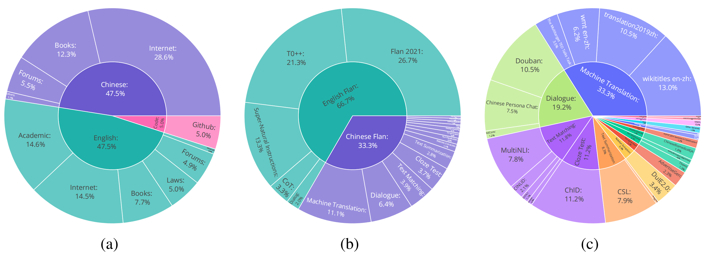

# OpenBT5-LM
这是官方的OpenBT5项目：一个从头开始预训练的开源15B双语Flan-T5模型。

[](LICENSE)
[](DATA_LICENSE)
[](MODEL_LICENSE)

[[中文版](README_ZH.md)] [[English](README.md)]

## 目录
- [开源计划](#开源计划)
- [训练过程](#训练过程)
- [评测结果](#评测结果)
  - [C-EVAL](#c-eval)
  - [BBH](#bbh)
  - [阅读理解](#阅读理解)
  - [机器翻译](#机器翻译)
- [用法](#用法)
  - [演示](#展示)
  - [训练](#训练)
- [详细信息](#详细信息)
  - [模型结构](#模型结构)
  - [训练数据](#训练数据)
- [免责声明](#免责声明)


## 开源计划
我们开源了两个版本你的模型，另一个模型即将开源：
- [OpenBT5-LM](https://huggingface.co/OpenBT5/OpenBT5-LM)：支柱语言模型预训练在英语、中文和代码令牌上的340B。
- [OpenBT5-Flan](https://huggingface.co/OpenBT5/OpenBT5-Flan)：我们对基础模型进行监督式微调，额外使用40B令牌和我们收集的BiFlan数据集。
- OpenBT5-Chat：即将推出

## 训练过程
<p align="center" width="100%">
<a target="_blank"></a>
</p>

## 评估结果

### C-EVAL
下表是模型在C-Eval基准测试中的性能，其中\#Param.表示模型参数，$*$表示CoT，Avg.表示平均准确率。我们汇报5-shot和0-shot性能，用对角线条划分。

| Model | #Param. | STEM | Social Science | Humanities | Others | Avg. | Avg.(Hard) |
| :--- | :---: | :---: | :---: | :---: | :---: | :---: | :---: |
| LLaMA | 65B | 37.8 | 45.6 | 36.1 | 37.1 | 38.8 | 31.7 |
| ChatGLM | 6B | 33.3 | 48.3 | 41.3 | 38.0 | 38.9 | 29.2 |
| Baichuan | 7B | 38.2 | 52.0 | 46.2 | 39.3 | 42.8 | 31.5 |
| MOSS-moon-sft | 16B | 31.6 | 37.0 | 33.4 | 32.1 | 33.1 | 28.4 |
| GLM-130B | 130B | 36.7 | 55.8 | 47.7 | 43.0 | 44.0 | 30.7 |
| OpenBT5 | 15B | 34.8 | 46.6 | 41.1 | 41.5 | 39.8 | 31.1 |
### BBH
下表是模型在BBH基准测试中的性能，其中\#Param.表示模型参数。我们报告所有模型的准确率。

| Model | #Param. | BBH |
| :--- | :---: | :---: |
| ChatGLM | 6B | 31.3 |
| Baichuan | 7B | 31.9 |
| BatGPT | 15B | **34.1**  |
| MOSS | 16B | 29.3 |
| OpenBT5 | 15B | **34.1**  |

### 阅读理解
下表是模型在BELEBELE基准测试中的性能，其中\#Param.表示模型参数，$\dagger$表示5-shot设置，$\ddagger$表示全英文微调，$*$表示针对指导模型的0-shot设置。

| Model | #Param. | eng_Latn | zho_Hans | zho_Hant | Avg. |
| :--- | :---: | :---: | :---: | :---: | :---: |
| Falcon $(†)$ | 40B | 77.2 | 66.0 | 62.2 | 68.5 |
| LLaMA $(†)$ | 70B | **82.5**  | 64.6 | 57.7 | 68.2 |
| InfoXLM $(‡)$ | 550M | 79.3 | 74.6 | 72.4 | 75.4 |
| XLM-V $(‡)$ | 1.2B | 76.2 | 71.0 | 67.1 | 71.4 |
| LLaMA2-Chat $(*)$ | 70B | 78.8 | 62.4 | 59.3 | 66.8 |
| OpenBT5 $(*)$ | 15B | 78.6 | **75.2**  | **73.7**  | **75.8**  |

### 机器翻译
模型在包含从Flores基准测试中采样的50个句子的Flores子集上的性能，其中\#Param.表示模型参数。我们报告所有模型的BLEU。

| Model | #Param. | Zh $\Rightarrow$ En | En $\Rightarrow$ Zh |
| :--- | :---: | :---: | :---: |
| ChatGLM | 6B | 17.2 | 32.5  |
| Alpaca | 7B | 15.1 | 9.8 |
| Alpaca-LoRA | 7B | 16.4 | 14.5 |
| PARROT | 7B | 19.6  | 24.8 |
| BatGPT | 15B | 23.1  | 38.7 |
| MOSS | 16B | 17.2 | 32.5 |
| OpenBT5 | 15B | 23.3 | 37.4  |
## 用法
### 演示 
首先，你需要安装以下的依赖：
```bash
pip install transformers torch>=2.0 sentencepiece
```

对于推理，注意我们在长度适应和微调阶段恢复了任务token `<S>` 和特殊token `<extra_id_0>` ，所以你可以将输入指令格式化为 `<S> {your input} <extra_id_0>` 以获得更好的答案。

以下是使用`OpenBT5-LM`的句子补全示例。
```python
>>> from transformers import AutoTokenizer, AutoModelForSeq2SeqLM
>>> tokenizer = AutoTokenizer.from_pretrained("OpenBT5/OpenBT5-LM", trust_remote_code=True)
>>> model = AutoModelForSeq2SeqLM.from_pretrained("OpenBT5/OpenBT5-LM", trust_remote_code=True).half().cuda()
>>> model = model.eval()
>>> query = "<S>" + "苏州处太湖平原，沿江为高沙平原，河" + "<extra_id_0>"
>>> inputs = tokenizer(query, return_tensors="pt").to("cuda")
>>> outputs = model.generate(**inputs, do_sample=True, max_new_tokens=32)
>>> response = tokenizer.decode(outputs[0], skip_special_tokens=True)
>>> print(response)
流两侧为河淤平原,苏州平原是江苏平原主体,地势低平,土地肥沃,气候温和
```

以下是使用`OpenBT5-Flan`的指令示例。
```python
>>> from transformers import AutoTokenizer, AutoModelForSeq2SeqLM
>>> tokenizer = AutoTokenizer.from_pretrained("OpenBT5/OpenBT5-Flan", trust_remote_code=True)
>>> model = AutoModelForSeq2SeqLM.from_pretrained("OpenBT5/OpenBT5-Flan", trust_remote_code=True).half().cuda()
>>> model = model.eval()
>>> query = "<S>" + "介绍一下中国的四大名著，并分别概括其主要内容" + "<extra_id_0>"
>>> inputs = tokenizer(query, return_tensors="pt").to("cuda")
>>> outputs = model.generate(**inputs, do_sample=True, max_new_tokens=256)
>>> response = tokenizer.decode(outputs[0], skip_special_tokens=True)
>>> print(response)
中国的四大名著分别是《红楼梦》、《西游记》、《水浒传》和《三国演义》。它们分别包括故事情节、文化内涵和历史背景等方面的不同特点。《红楼梦》是一部中国古典小说,讲述了贾宝玉、林黛玉、薛宝钗等一群人物在贾府的生活和爱情故事。《西游记》是中国著名小说,描述了孙悟空、猪八戒、沙悟净等一众妖魔鬼怪的冒险历程和故事。《水浒传》是一部中国古典小说,描述了宋江等一百零八位好汉的反抗故事。《三国演义》是中国古代著名小说,讲述了三国时期的历史和战争故事。这些小说在文学、历史、哲学和文化等方面都有着不同的影响和地位。
```
### 训练
我们的训练代码放在`training`文件夹中。基于[Megatron-LM](https://github.com/NVIDIA/Megatron-LM/)，我们进行了以下实现：
- SwiGLU激活函数，
- UL2训练目标，
- 旋转位置嵌入，
- 一个统一的MMap数据处理方法，适用于预训练和微调阶段。

对于预训练，应事先安装相关要求，如[Megatron-LM](https://github.com/NVIDIA/Megatron-LM/)中所述，然后您可以简单地运行以下命令将文本处理为字节，这样MMap数据集可以更快地读取：

```bash
cd training
bash scripts/data_process_span_corr.sh  # 处理预训练数据
bash scripts/data_process_flan.sh  # 处理微调数据
```

您可以通过以下命令在多个节点上运行分布式训练
```bash
bash scripts/run_pretrain.sh  # 预训练
bash scripts/run_stretch.sh  # 长度适应
bash scripts/run_flan.sh   # 微调
```

## 详细信息

### 模型结构
一般来说，OpenBT5模型遵循类似T5的标准encoder-decoder架构。
值得注意的是，编码器和解码器扮演不同的角色，其中编码器赋予模型强大的理解能力，而解码器带来模型的生成能力，并且已有的工作表明，具有更多encoder层的encoder-decoder模型可以实现强大的性能。
为了填补更深的解码器为基础的LLM的空白，我们还设计了一个非对称结构，其中超参数列在下表中。
| 编码器 | 解码器 | Attn Heads | $d_{model}$ | $d_{ff}$ | #Param.(B) | 词汇表大小 | 训练令牌 | Pos Emb |
| :---: | :---: | :---: | :---: | :---: | :---: | :---: | :---: | :---: | 
| 12 | 36 | 40 | 4096 | 16384 | 14.6 | 251000 | 380B  | RoPE  |

- 语言：中文/英文
- 许可证：本项目中的代码根据Apache 2.0许可证进行许可，模型权重根据GNU AGPL 3.0许可证进行许可。如果您打算将本项目中的模型用于商业用途或公共部署，请发送电子邮件给我们以获得授权。商业使用信息仅用于记录目的，不收费。
### 训练数据

<p align="center" width="100%">
<a target="_blank"></a>
</p>
数据收集的组成。图(a)表示预训练数据集的组成比例。图(b)表示双语Flan数据集的组成。图(c)表示中文Flan数据集的更细粒度组成。

## 免责声明
使用OpenBT5-LM应遵循社会规范，不得用于危害国家或社会安全或违反法律的活动。此外，我们还要求用户不要将OpenBT5-LM用于尚未经过适当安全审查和记录的互联网服务。我们希望所有用户都遵守这一原则，确保技术发展在一个有序、合法的环境中进行。

我们已尽最大努力确保模型训练过程中使用的数据符合规定。然而，尽管我们付出了巨大的努力，但由于模型和数据的复杂性，仍可能出现意外问题。如果在提供服务过程中，通过使用本项目中包含的模型或其修改版本生成误导性或有害的陈述，责任在于服务提供商，与本项目无关。